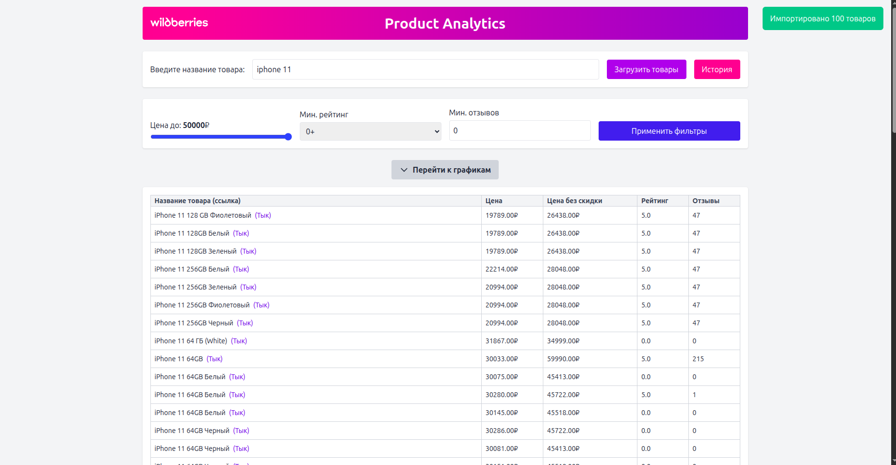

# 🛍️ Django Wildberries Analytics

Cервис аналитики товаров Wildberries с визуализацией данных.

## 📌 Описание

Сервис позволяет:
- парсить товары Wildberries по поисковому запросу; 
- по умолчанию — до 100 товаров и до 50 000₽ (эти параметры можно изменить в коде при необходимости);
- сохранять данные в БД;
- фильтровать товары по цене, рейтингу и количеству отзывов;
- отображать их в виде таблицы;
- строить графики;
- просматривать историю поисков.


## ⚙️ Стек технологий

- Backend: Python, Django, Django REST Framework
- Frontend: HTML, Tailwind CSS, Vanilla JS
- Парсинг: кастомная `management`-команда
- Графики: Chart.js
- База данных: SQLite
- Тестирование: Pytest + pytest-django


## 🧩 Установка и запуск

1. **Клонируй репозиторий**
```bash
git clone https://github.com/Exslayder/django_analytics.git
cd django_analytics
```
2. **Создай виртуальное окружение и активируй его**
```bash
python3 -m venv env
source env/bin/activate
```
3. **Установи зависимости**
```bash
pip install -r requirements.txt
```
4. **Примени миграции**
```bash
python manage.py makemigrations products
python manage.py migrate
```
5. **Запусти сервер**
```bash
python manage.py runserver
```
6. **Открой в браузере**
```bash
http://127.0.0.1:8000/
```


## 🔍 Как пользоваться

✅ Парсинг
1. Введите поисковый запрос.
2. Нажмите “Загрузить товары” — спарсятся данные и отобразятся в таблице.

✅ Фильтры
1. Ползунок: фильтрация по цене.
2. Вводные поля: минимальный рейтинг, минимальное количество отзывов.

✅ Сортировка
1. Нажмите на заголовок таблицы — работает по всем колонкам.

✅ Графики
1. Гистограмма: распределение цен.
2. Линейный график: скидка от рейтинга.

✅ История
1. Кнопка "История" — модальное окно с предыдущими поисковыми запросами.


## 🧪 Тестирование
**Запусти**
```bash
pytest
```
**Тестируются:**
- API фильтрации
- Ответы на некорректные запросы
- Вызов команды парсинга

## 📁 Структура проекта
```bash
django_analytics/
├── manage.py
├── django_analytics/
│   ├── __init__.py
│   ├── settings.py
│   ├── urls.py
│   └── wsgi.py
├── products/
│   ├── __init__.py
│   ├── admin.py
│   ├── apps.py
│   ├── models.py
│   ├── serializers.py
│   ├── views.py
│   ├── urls.py
│   ├── tests.py
│   └── management/
│       └── commands/
│           └── parse_wb.py
├── static/
│   ├── css/
│   │   └── style.css
│   └── js/
│       └── main.js
├── templates/
│   └── index.html
├── requirements.txt
├── README.md
└── pytest.ini

```

## 🛠 TODO/Дополнительно
- Добавить авторизацию (если потребуется).
- Сохранение истории в БД вместо кэша.
- Расширить фильтры (например, по скидке).
- Улучшить адаптацию под мобильные устройства.

## 🖼️ Пример интерфейса



## 🧾 Пример API запроса
```bash
GET /api/products/?min_price=5000&min_rating=4&min_reviews=100
```

## 📬 Контакты
Если возникли вопросы, вы можете связаться со мной: ihar.danilenka@gmail.com
